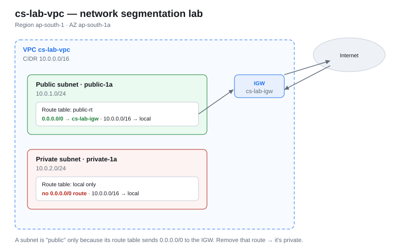

# aws-security-labs

Hands-on AWS security labs, built from scratch and **proven with real allowed/denied API calls** —
not console screenshots. Network segmentation, least-privilege IAM, and data protection, each one
documented with the security reasoning behind every decision and how to verify it yourself.

**Region:** `ap-south-1` (Mumbai) · **Phase 2** of an 8-month cloud-security track.

> 🔭 **Detection & alerting lives in its own repo:**
> [**cloud-logging-pipeline**](https://github.com/genzyyhub/cloud-logging-pipeline) — CloudTrail →
> CloudWatch → metric filter → alarm → SNS, proven live with a real root-account login.

---

## The through-line

Every lab here is a variation on one idea: **a control you can't verify isn't a control.** So each
one is built, then deliberately broken or probed, then read back. That's how the two silent failures
in this repo were caught — a route table that had blackholed after a teardown, and a versioning
setting that never actually applied despite the command returning no error.

---

## What this is

A custom VPC (`10.0.0.0/16`) split into a **public** and a **private** subnet, with an Internet
Gateway and route tables wired so that:

- the **public** subnet can send/receive traffic to the internet (via the IGW), and
- the **private** subnet has **no inbound path from the internet** — nothing outside can initiate a
  connection to it.

That single routing decision is the whole point: *a subnet is "public" only because its route table
sends `0.0.0.0/0` to the Internet Gateway.* Remove that route and the same subnet is private.

## Architecture



```
VPC  cs-lab-vpc  10.0.0.0/16   (ap-south-1)
│
├── Public subnet   public-1a   10.0.1.0/24   (ap-south-1a)
│     route table: public-rt  →  0.0.0.0/0 via cs-lab-igw   ← this makes it "public"
│
├── Private subnet  private-1a  10.0.2.0/24   (ap-south-1a)
│     route table: local only  →  no 0.0.0.0/0 route        ← no inbound from internet
│
└── Internet Gateway  cs-lab-igw  (attached to VPC)
```

> A console screenshot of the built VPC lives at `docs/vpc-console.png`
> (save your AWS "Your VPCs" resource-map screenshot there).

## Design decisions (the security reasoning)

| Decision | Why |
|---|---|
| `/16` VPC, `/24` subnets | Room to grow (256 subnets of 256 hosts) without re-addressing; keeps CIDR math simple. |
| Separate public vs private subnets | Segmentation. The blast radius of a compromised public host stops at the subnet boundary. |
| Public route table → IGW | The **only** thing that grants internet reachability. Explicit, auditable, one line to revoke. |
| Private subnet has no IGW route | Defence in depth — even a misconfigured Security Group can't expose it inbound to the internet. |
| Private subnet reaches out via NAT (when needed) | Outbound-only: instances can pull updates, but nothing on the internet can initiate a connection in. |

### Security Groups vs NACLs (why both exist)

- **Security Group** = *stateful* "bouncer with memory," attached **per instance**. Allow-only
  rules; return traffic for an allowed request is automatically permitted.
- **NACL** = *stateless* "wall around the building," attached **per subnet**, evaluates **both**
  directions independently, supports explicit **deny**.

Layering a per-subnet NACL under per-instance SGs means one misconfigured SG doesn't undo your
subnet-level guardrail.

## How to verify what you built

Read the network back with the CLI (uses your least-privilege IAM user, never root):

```bash
aws ec2 describe-vpcs           --filters "Name=tag:Name,Values=cs-lab-vpc"
aws ec2 describe-subnets        --filters "Name=vpc-id,Values=<vpc-id>"
aws ec2 describe-route-tables   --filters "Name=vpc-id,Values=<vpc-id>"
aws ec2 describe-internet-gateways --filters "Name=attachment.vpc-id,Values=<vpc-id>"
```

Confirm: the public subnet's route table has a `0.0.0.0/0 → igw-...` route, and the private
subnet's route table does **not**.

## Cost / cleanup

Free-tier safe as built (VPC, subnets, route tables, and an Internet Gateway cost nothing).
**NAT Gateways and running EC2 instances do cost money** — delete/terminate them when you're done
so free-tier charges don't sneak in.

## Lab log

- **[Lab 04 — Launch an EC2 in the public subnet](docs/lab-04-ec2-public-subnet.md)** ✅
  Launched a `t3.micro` into `10.0.1.0/24`, hit an **SSH connection-timeout**, and traced it to a
  **missing `0.0.0.0/0 → IGW` route** on the public subnet's route table. Fixed with a dedicated
  public route table (private subnet left isolated), then verified SSH access + internet egress.
  Includes the full debugging story and the security takeaways.

- **[Lab 05 — NAT Gateway: outbound-only internet for the private subnet](docs/lab-05-nat-gateway.md)** ✅
  Added a **NAT Gateway** (in the public subnet) and pointed `private-rt` at it (`0.0.0.0/0 → NAT`).
  Launched a **no-public-IP** EC2 in the private subnet, connected with **SSM Session Manager**
  (no bastion, no key, no inbound rule), and proved egress: `curl ifconfig.me` returned the NAT's
  Elastic IP. Confirms **outbound-only** internet with **no inbound path**. Includes Mermaid diagrams
  and the full verification.

- **[Lab 06 — Security Group (stateful) vs NACL (stateless)](docs/lab-06-sg-vs-nacl.md)** ✅
  Proved the difference by building it, breaking it, and fixing it: stripped **all** outbound rules
  off an SG and traffic still flowed (stateful); then a subnet NACL with **inbound-only** made the
  same request **time out** until an **outbound ephemeral (1024–65535)** rule opened the return path
  (stateless). Includes Mermaid diagrams, the ephemeral-port explanation, and a comparison table.

- **[Lab 07 — Least-privilege IAM policy + AssumeRole](docs/lab-07-least-privilege-iam.md)** ✅
  Wrote an `EC2ReadOnlyPolicy` (Describe-only), attached it to `EC2ReadOnlyRole` behind a scoped
  trust policy, then proved it two ways: `iam simulate-principal-policy` (on paper) and a real
  `sts assume-role` + live API calls (`describe-instances` allowed, `s3 ls` denied). Includes the
  policy-evaluation-order diagram (explicit deny > explicit allow > implicit deny) and the trust-vs-
  permission-policy distinction.

- **[Lab 08 — 3-tier VPC (web/app/data) — Phase 2 flagship](docs/lab-08-three-tier-vpc.md)** ✅
  Added an isolated `data` subnet (no IGW, no NAT — structurally unreachable from the internet) and
  chained three security groups **by reference, not CIDR**: web-sg (open to the internet) → app-sg
  (trusts only web-sg) → data-sg (trusts only app-sg). Rebuilt the NAT Gateway torn down after Lab
  05, launched one instance per tier via SSM, and proved it live: `web→app` succeeded, `web→data`
  was silently blocked, `app→data` succeeded — same destination, same port, only the asker changed.

- **[Lab 09 — Secure S3 data store — Phase 2 closer](docs/lab-09-secure-s3-baseline.md)** ✅
  Block Public Access (all four settings), default SSE-S3 encryption, versioning, and a two-statement
  bucket policy denying any request over plain HTTP and any upload missing the encryption header —
  proved with real denied and allowed `PutObject` calls, not console toggles. `aryan-admin` carries
  full `AdministratorAccess` at the IAM level and the bucket policy still blocked the unencrypted
  upload — a resource-based Deny overrides even an administrator identity. Includes a real caught
  bug: versioning silently didn't apply on the first attempt, caught by reading back
  `get-bucket-versioning` instead of trusting the command hadn't errored.

- **Lab 10 — CloudTrail → CloudWatch → Alarm → SNS** ✅ → **moved to its own repo:**
  [**cloud-logging-pipeline**](https://github.com/genzyyhub/cloud-logging-pipeline)
  The first *detection* pipeline — CloudTrail into CloudWatch Logs via a least-privilege role, a
  metric filter on root console logins, alarm → SNS → inbox. Proved live: a real root sign-in flipped
  the alarm `OK -> ALARM` on a datapoint of `2.0` and delivered an email. Split out because detection
  and alerting is a distinct project from network/IAM/storage labs — and it keeps growing
  (EventBridge, then GuardDuty and Security Hub).

## What I'd do next

- ✅ ~~Launch an EC2 in the public subnet and verify reachability~~ → see [Lab 04](docs/lab-04-ec2-public-subnet.md).
- ✅ ~~Add a **NAT Gateway** so the private subnet gets outbound-only internet~~ → see [Lab 05](docs/lab-05-nat-gateway.md).
- ✅ ~~Attach a **Security Group** and a subnet **NACL**, and test them~~ → see [Lab 06](docs/lab-06-sg-vs-nacl.md).
- ✅ ~~Write + test a least-privilege IAM policy via assume-role~~ → see [Lab 07](docs/lab-07-least-privilege-iam.md).
- ✅ ~~Grow to a **3-tier VPC** (web / app / data subnets) and chain security groups by reference~~ → see [Lab 08](docs/lab-08-three-tier-vpc.md).
- ✅ ~~Secure S3 data store (Block Public Access, bucket/resource policies, encryption, versioning)~~ → see [Lab 09](docs/lab-09-secure-s3-baseline.md). **Phase 2 complete.**
- ✅ ~~Build a real detection pipeline: CloudTrail → CloudWatch Logs → metric filter → alarm → SNS~~ → now in [cloud-logging-pipeline](https://github.com/genzyyhub/cloud-logging-pipeline). **Phase 3 flagship complete.**
- Reconstruct the whole thing as **Terraform** and scan it with `checkov` / `tfsec`; extend to two AZs for real high availability. (Phase 4.)

---

### ⚠️ Security note

No credentials, access keys, or `.csv` exports are included in this repo — the `.gitignore` blocks
them. Never commit AWS keys to GitHub; automated scanners find and abuse them within minutes.

---

**Related repos:**
[secure-aws-account-baseline](https://github.com/genzyyhub/secure-aws-account-baseline) — taking a fresh AWS account from zero to hardened ·
[cloud-logging-pipeline](https://github.com/genzyyhub/cloud-logging-pipeline) — CloudTrail → CloudWatch → SNS detection, proven live
