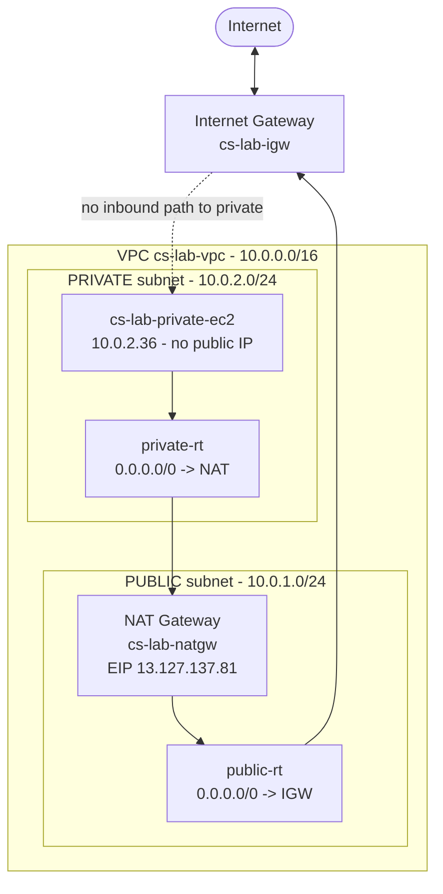

# Lab 05 — NAT Gateway: outbound-only internet for the private subnet

**Phase 2 · AWS Core + Identity** · Region `ap-south-1` (Mumbai) · Date: 2026-07-20

> Goal: let an instance in the **private** subnet of `cs-lab-vpc` reach the internet (updates,
> package installs) **without** ever being reachable *from* the internet. Built entirely from the
> AWS CLI, and connected to the private box with **SSM Session Manager** — no bastion, no SSH key,
> no inbound port.

---

## The one-line lesson

**An Internet Gateway is a two-way door; a NAT Gateway is a one-way valve.** The NAT lives in the
*public* subnet, and the private subnet points its default route at it. Instances get *out*;
nothing gets *in*.

## Architecture



## What I built

| Resource | Value |
|---|---|
| NAT Gateway | `cs-lab-natgw` (`nat-09fb174339b6d4958`) — in the **public** subnet |
| Elastic IP | `13.127.137.81` (attached to the NAT) |
| Private route table | `private-rt` — `0.0.0.0/0 → nat-...` (+ `10.0.0.0/16 local`) |
| Test instance | `cs-lab-private-ec2` (`i-06634f65f9089e0e9`) · `t3.micro` · AL2023 · `10.0.2.36` · **no public IP** |
| Access method | **SSM Session Manager** (instance role `AmazonSSMManagedInstanceCore`) |
| Security Group | `private-sg` — **no inbound rules** (SSM is outbound-only) |

## Build (CLI)

```bash
# 1) Elastic IP for the NAT
EIP_ALLOC=$(aws ec2 allocate-address --domain vpc \
  --tag-specifications 'ResourceType=elastic-ip,Tags=[{Key=Name,Value=cs-lab-nat-eip}]' \
  --query AllocationId --output text)

# 2) NAT Gateway IN THE PUBLIC SUBNET
NATGW=$(aws ec2 create-nat-gateway --subnet-id $PUBLIC_SUBNET --allocation-id $EIP_ALLOC \
  --tag-specifications 'ResourceType=natgateway,Tags=[{Key=Name,Value=cs-lab-natgw}]' \
  --query NatGateway.NatGatewayId --output text)
aws ec2 describe-nat-gateways --nat-gateway-ids $NATGW --query "NatGateways[0].State"  # wait: available

# 3) private route table -> NAT
PRIVATE_RT=$(aws ec2 create-route-table --vpc-id $VPC \
  --tag-specifications 'ResourceType=route-table,Tags=[{Key=Name,Value=private-rt}]' \
  --query RouteTable.RouteTableId --output text)
aws ec2 associate-route-table --route-table-id $PRIVATE_RT --subnet-id $PRIVATE_SUBNET
aws ec2 create-route --route-table-id $PRIVATE_RT \
  --destination-cidr-block 0.0.0.0/0 --nat-gateway-id $NATGW
```

## Verification (the proof)

```text
## Private route table
0.0.0.0/0   -> nat-09fb174339b6d4958   (active)
10.0.0.0/16 -> local                    (active)

## Private instance
PrivateIp 10.0.2.36 · PublicIp None · running

## SSM PingStatus
Online          # a no-public-IP box reached AWS -> only possible via the NAT

## Egress identity (curl ifconfig.me, run on the private instance)
egress IP : 13.127.137.81
NAT EIP   : 13.127.137.81      # MATCH -> traffic leaves wearing the NAT's address
```

The private instance's traffic exits the internet as `13.127.137.81` (the NAT), never as its own
`10.0.2.36`. And because a NAT creates **no inbound path**, nothing on the internet can initiate a
connection to it.

## Why SSM instead of a bastion

The private instance has no public IP and `private-sg` has **no inbound rules**. The SSM agent dials
*out* through the NAT to reach the SSM service, so `aws ssm start-session --target <id>` connects
from CloudShell with **no SSH, no key, and nothing to scan**. Strictly more secure than opening SSH
through a bastion.

## Security reasoning

| Decision | Why |
|---|---|
| NAT in the **public** subnet | It needs the IGW route to reach the internet on the private subnet's behalf. |
| Private subnet → NAT (egress only) | Instances can patch/update, but the internet can't initiate inbound — defence in depth. |
| `private-sg` with no inbound | Nothing to brute-force; access is via SSM's outbound channel only. |
| IMDSv2 (inherited pattern) | Closes the SSRF → credential-theft class (the Capital One breach). |

## Cost / cleanup ⚠

NAT Gateway + Elastic IP **bill by the hour** (unlike IGW/subnets/route tables, which are free).
Cleanup order matters:

```bash
aws ec2 terminate-instances --instance-ids $PRIVATE_EC2
aws ec2 delete-nat-gateway  --nat-gateway-id $NATGW      # wait for state: deleted
aws ec2 release-address     --allocation-id $EIP_ALLOC   # only AFTER the NAT is deleted
```

All billable resources were torn down at the end of this lab.

## Gotcha log

- **Shell vars reset between commands** (`$NATGW`/`$EIP_ALLOC` empty → "expected one argument").
  Re-derived from tags: `describe-nat-gateways --filter "Name=tag:Name,Values=cs-lab-natgw"`.
  Takeaway: capture resource IDs to a scratch file as you go.
- **Release-after-delete:** releasing the EIP before the NAT finished deleting throws a dependency
  error — wait for `deleted` first.

## What's next

- Attach a **least-privilege Security Group** and a subnet **NACL**, and test stateful vs stateless.
- Grow to a **3-tier VPC** (web/app/data) across two AZs.
- Rebuild as **Terraform**, scan with `checkov` / `tfsec`.
