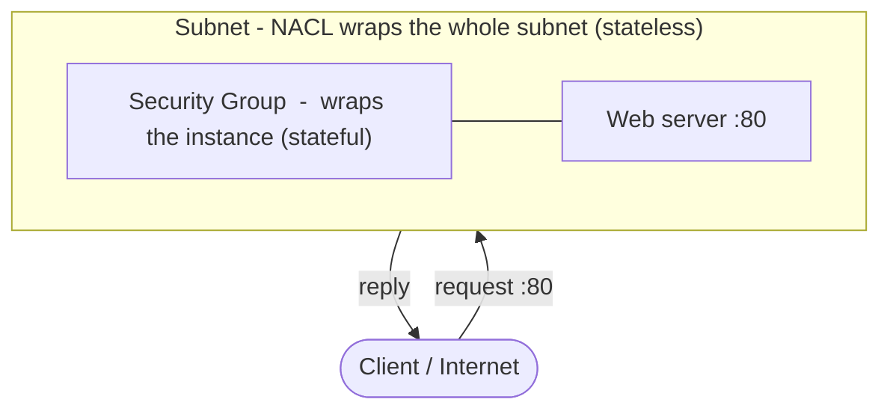
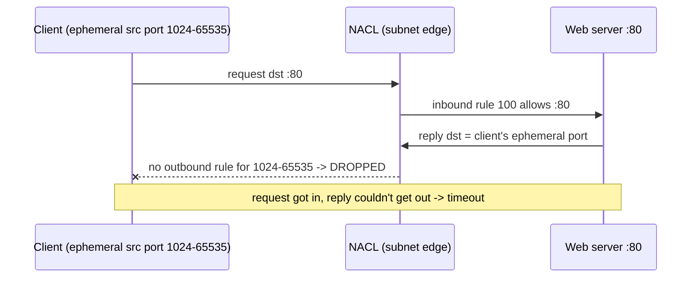

# Lab 06 — Security Group (stateful) vs NACL (stateless)

**Phase 2 · AWS Core + Identity** · Region `ap-south-1` (Mumbai) · Date: 2026-07-21

> Goal: *prove* the difference between a Security Group and a Network ACL by building it, breaking
> it on purpose, and fixing it. Tested with `curl` from AWS CloudShell (acting as "the internet") —
> no SSH, no keys.

---

## The one-line lesson

**A Security Group remembers a connection; a NACL does not.** An SG is *stateful* and wraps the
**instance** — allow a request in and the reply is auto-allowed out. A NACL is *stateless* and wraps
the **subnet** — inbound and outbound are separate lists, so you must open the return path yourself.

## Where each control sits



## Test 1 — Security Group is stateful

1. Launched a `t3.micro` web server (`httpd` via user-data) in the public subnet; SG `web-sg` allowed
   inbound TCP 80.
2. `curl http://<public-ip>` → returned the page. ✅
3. **Revoked every outbound rule** on `web-sg` (`IpPermissionsEgress: []`).
4. `curl` again → **still returned the page.** ✅

**Why:** the SG tracks the connection state, so the reply to an allowed inbound request is permitted
automatically — no outbound rule required. That's *stateful*.

## Test 2 — NACL is stateless

1. Created a **custom NACL** (denies everything until you add allows) and associated it with the
   public subnet.
2. Added **inbound** allow for TCP 80 only — deliberately no outbound rule.
3. `curl` → **timed out** (`curl: (28) Connection timed out`).



4. **Fix:** added an **outbound** allow for the ephemeral range `1024–65535`.
5. `curl` → returned the page. ✅

**Why:** a NACL is stateless with separate inbound/outbound lists. The server's reply goes to the
client's ephemeral port, so that range must be allowed **outbound** explicitly — the return path an
SG handles for free. A custom NACL also has an immutable `32767 * DENY` in each direction, which is
what dropped the reply when no outbound allow existed.

## The rules that made the NACL work

```bash
# inbound: allow the request in
aws ec2 create-network-acl-entry --network-acl-id $NACL --rule-number 100 \
  --protocol tcp --port-range From=80,To=80 --cidr-block 0.0.0.0/0 --rule-action allow --ingress
# outbound: allow the reply out (ephemeral ports)
aws ec2 create-network-acl-entry --network-acl-id $NACL --rule-number 100 \
  --protocol tcp --port-range From=1024,To=65535 --cidr-block 0.0.0.0/0 --rule-action allow --egress
```
`--ingress` and `--egress` are separate lists, so rule-number `100` is valid on both.

## SG vs NACL — reference

| | Security Group | NACL |
|---|---|---|
| Attached to | an instance (ENI) | a subnet |
| State | **Stateful** (remembers) | **Stateless** (no memory) |
| Return traffic | auto-allowed | needs an explicit rule |
| Rules | allow only | allow **and** deny |
| Evaluation | all rules together | numbered, lowest first, first match wins |
| Custom default | deny in / allow out | deny **both** ways until you add allows |

**Defence in depth:** run a per-subnet NACL guardrail *under* per-instance SGs, so one misconfigured
SG can't undo the subnet-level wall.

## Cost / cleanup

All free-tier (one `t3.micro`, no NAT/EIP this lab). Cleanup: moved the subnet back to the default
NACL, deleted the custom NACL(s), terminated the instance, deleted `web-sg`.

## What's next

- Rebuild this from memory (no script) as a retention check.
- The **3-tier VPC** flagship: web / app / data subnets across two AZs + least-privilege IAM.
