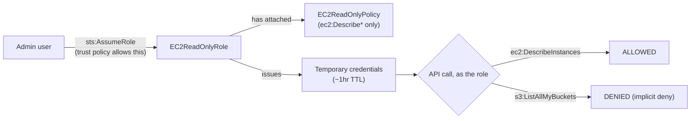
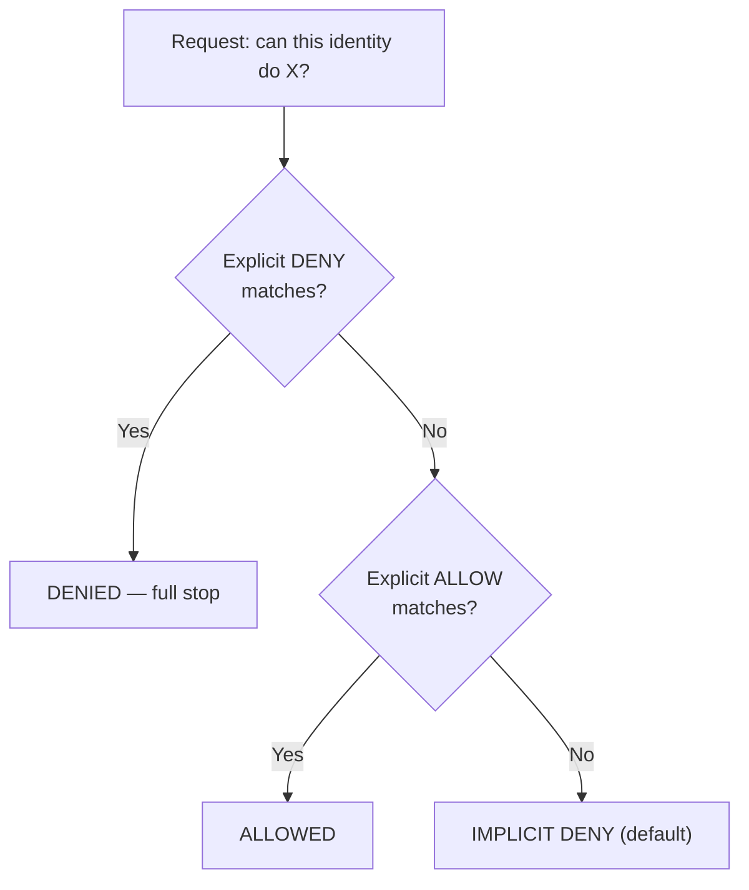

# Lab 07 — Least-Privilege IAM Policy + AssumeRole

**Phase 2 · AWS Core + Identity** · Region `ap-south-1` (Mumbai) · Date: 2026-07-23

> Goal: write a policy that grants exactly one capability, attach it to a role (not a user), and
> *prove* the restriction two ways — on paper with the IAM policy simulator, and for real by
> assuming the role and making live API calls.

---

## The one-line lesson

A role has **two separate policies** answering two separate questions: the **trust policy** answers
*"who can become this role?"*; the **permission policy** answers *"what can it do once someone
becomes it?"*. They are commonly conflated — they shouldn't be.

## Architecture



## Policy evaluation order



**Explicit deny beats explicit allow, but only on the specific action/resource it matches** — it
doesn't deny the whole request, and it isn't a sign of misconfiguration. It's the exact mechanism
that makes deny-based guardrails (SCPs, permission boundaries) meaningful: no matter how generous
another policy is, an explicit deny clamps that one thing shut regardless.

## Build

**Permission policy** — allow-only, EC2 Describe calls:
```json
{
  "Version": "2012-10-17",
  "Statement": [
    { "Sid": "EC2ReadOnly", "Effect": "Allow", "Action": ["ec2:Describe*"], "Resource": "*" }
  ]
}
```
```bash
aws iam create-policy --policy-name EC2ReadOnlyPolicy --policy-document file://ec2-readonly-policy.json
```

**Trust policy** — who can assume the role (scoped to this account only):
```json
{
  "Version": "2012-10-17",
  "Statement": [
    { "Effect": "Allow", "Principal": { "AWS": "arn:aws:iam::<account-id>:root" }, "Action": "sts:AssumeRole" }
  ]
}
```
```bash
aws iam create-role --role-name EC2ReadOnlyRole --assume-role-policy-document file://trust-policy.json
aws iam attach-role-policy --role-name EC2ReadOnlyRole --policy-arn arn:aws:iam::<account-id>:policy/EC2ReadOnlyPolicy
```

## Verify — on paper (simulator)

```bash
aws iam simulate-principal-policy --policy-source-arn arn:aws:iam::<account-id>:role/EC2ReadOnlyRole \
  --action-names ec2:DescribeInstances ec2:RunInstances s3:ListAllMyBuckets
```
| Action | Result |
|---|---|
| `ec2:DescribeInstances` | **allowed** |
| `ec2:RunInstances` | **implicitDeny** |
| `s3:ListAllMyBuckets` | **implicitDeny** |

## Verify — for real (assume + live calls)

```bash
read -r AWS_ACCESS_KEY_ID AWS_SECRET_ACCESS_KEY AWS_SESSION_TOKEN <<< $(aws sts assume-role \
  --role-arn arn:aws:iam::<account-id>:role/EC2ReadOnlyRole --role-session-name iam-lab-test2 \
  --query 'Credentials.[AccessKeyId,SecretAccessKey,SessionToken]' --output text)
export AWS_ACCESS_KEY_ID AWS_SECRET_ACCESS_KEY AWS_SESSION_TOKEN

aws sts get-caller-identity     # confirms identity = assumed-role/EC2ReadOnlyRole/iam-lab-test2
aws ec2 describe-instances      # ALLOWED -> {"Reservations": []}
aws s3 ls                       # DENIED  -> AccessDenied, names identity + action + reason

unset AWS_ACCESS_KEY_ID AWS_SECRET_ACCESS_KEY AWS_SESSION_TOKEN   # return to admin identity
```

The denial names the exact identity, the exact action, and the exact reason — `AccessDenied` is the
system working as designed, not an error state to debug.

## Gotcha: `SignatureDoesNotMatch`

Manually copy-pasting a long, terminal-wrapped `SessionToken` produced `SignatureDoesNotMatch` (a
stray character/line-break almost certainly got introduced in transit). **Fix:** never hand-retype
long credential strings — capture them programmatically instead:
```bash
read -r VAR1 VAR2 VAR3 <<< $(aws some-command --query '[...]' --output text)
```

## Cost / cleanup

IAM roles/policies are free — left in place as a portfolio artifact, nothing to tear down.

## What's next

- **3-tier VPC** flagship (web / app / data subnets, two AZs) — the last piece before the Phase 2
  flagship project is complete.
- Layer a **permission boundary** onto a role once the 3-tier build exists.
