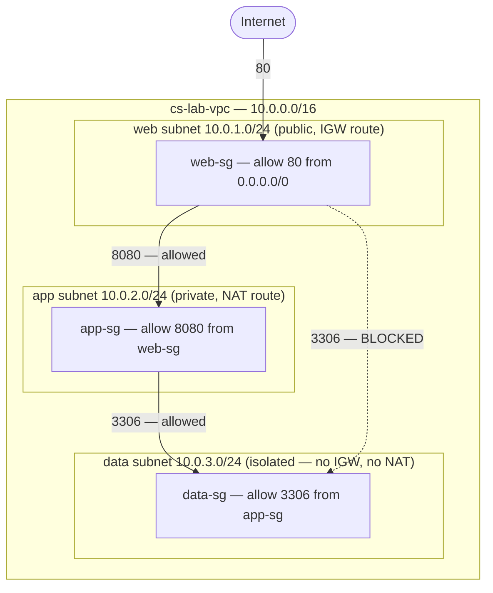
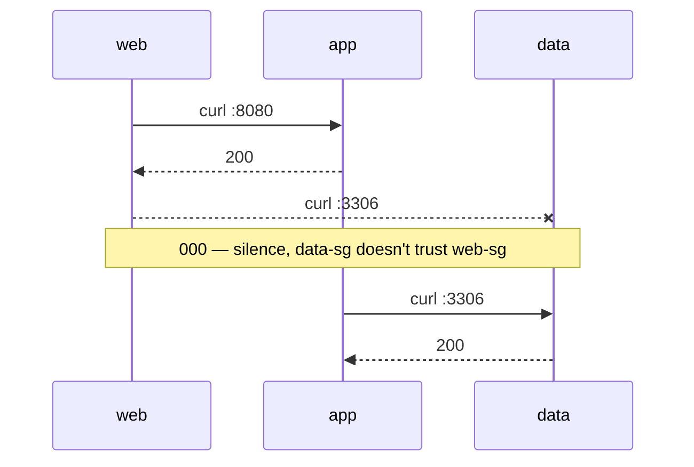

# Lab 08 — 3-Tier VPC (Web / App / Data) — Phase 2 Flagship

**Phase 2 · AWS Core + Identity** · Region `ap-south-1` (Mumbai) · Date: 2026-07-24

> Assembles Labs 04-07 (segmentation, NAT, SG vs NACL, least-privilege IAM) into one real
> architecture: three tiers, each able to reach only the tier directly before it — proved with
> live traffic, not just a diagram.

---

## The one-line lesson

Containment isn't about being unreachable — it's about who's allowed to ask. Every tier lived in the
same VPC, on the same physical network. The only thing deciding who could reach whom was which
security group each tier trusted.

## Architecture



Two independent layers enforce the same boundary: the data subnet has **no route to the internet at
all** (network layer), and its security group **only trusts the app tier** (access layer). Either
alone would contain a breach; both together is defence in depth.

## SG-to-SG referencing (new this lab)

Every earlier lab used CIDR-based rules. This one chains security groups **by reference**:

```bash
aws ec2 authorize-security-group-ingress --group-id <app-sg-id> --protocol tcp --port 8080 \
  --source-group <web-sg-id>

aws ec2 authorize-security-group-ingress --group-id <data-sg-id> --protocol tcp --port 3306 \
  --source-group <app-sg-id>
```

`--source-group` means "anyone currently wearing that security group" — not an address range. Scale
the web fleet or change its IPs and this rule needs zero updates; a CIDR-based internal rule would.
AWS's response confirms this with a `ReferencedGroupInfo` block naming the source SG directly.

## Isolating the data subnet structurally

```bash
aws ec2 create-subnet --vpc-id <vpc-id> --cidr-block 10.0.3.0/24 --availability-zone ap-south-1a \
  --tag-specifications "ResourceType=subnet,Tags=[{Key=Name,Value=data-1a}]"
aws ec2 create-route-table --vpc-id <vpc-id> \
  --tag-specifications "ResourceType=route-table,Tags=[{Key=Name,Value=data-rt}]"
aws ec2 associate-route-table --route-table-id <data-rt-id> --subnet-id <data-subnet-id>
```

`data-rt` only ever holds the automatic `10.0.0.0/16 → local` route — no IGW, no NAT. Consequence:
the data tier's SSM agent can never register (no path to AWS's SSM service exists at all) — expected,
not a bug, since we never need a shell inside the data instance, only to send it traffic.

## Gotcha: a blackholed route from Lab 5

Lab 5's NAT Gateway was torn down after that session. Checking the app tier's route table before
building on it showed a **blackhole** route — pointing at a NAT Gateway ID that no longer existed.
Fixed by deleting the dead route, allocating a fresh EIP, creating a new NAT Gateway, waiting for
`available`, then re-adding the route. Lesson repeated from Lab 5: verify current reality before
extending it — stale assumptions are exactly where labs break.

## Proving it live

One instance per tier, launched via SSM (`cs-lab-ssm-profile`, reused from Lab 5 — no keys, no
bastion). App and data each ran a one-line startup script (`nohup python3 -m http.server <port> &`).



| Test | Result | Why |
|---|---|---|
| web → app : 8080 | **200** | `app-sg` trusts `web-sg` |
| web → data : 3306 | **000** (timeout) | `data-sg` has no rule for `web-sg` |
| app → data : 3306 | **200** | `data-sg` trusts `app-sg` |

Same destination, same port, same security group — the only variable was which tier asked.

## Cost / cleanup

Terminated all 3 instances, deleted the NAT Gateway, released the EIP (confirmed via
`describe-addresses` returning empty). VPC, subnets, route tables, and security groups are free —
left in place as the portfolio artifact.

## What's next

- **Secure S3 data store** (Block Public Access, bucket/resource policies, encryption, versioning) —
  Phase 2's remaining flagship piece.
- Stretch: permission boundary on a role interacting with this architecture; extend to two AZs for
  real high availability.
